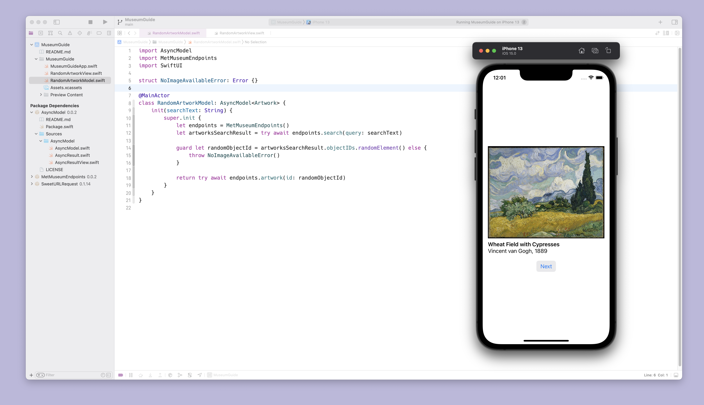

# MuseumGuide

Example project for the [AsyncView](https://github.com/ralfebert/AsyncView) and the [MetMuseumEndpoints](https://github.com/ralfebert/MetMuseumEndpoints/) Swift packages: shows a random artwork loaded from the [The Metropolitan Museum of Art API](https://metmuseum.github.io/):

